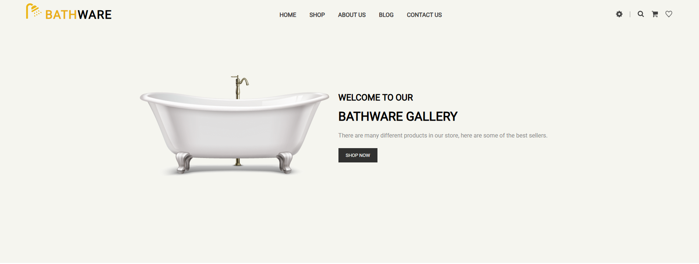
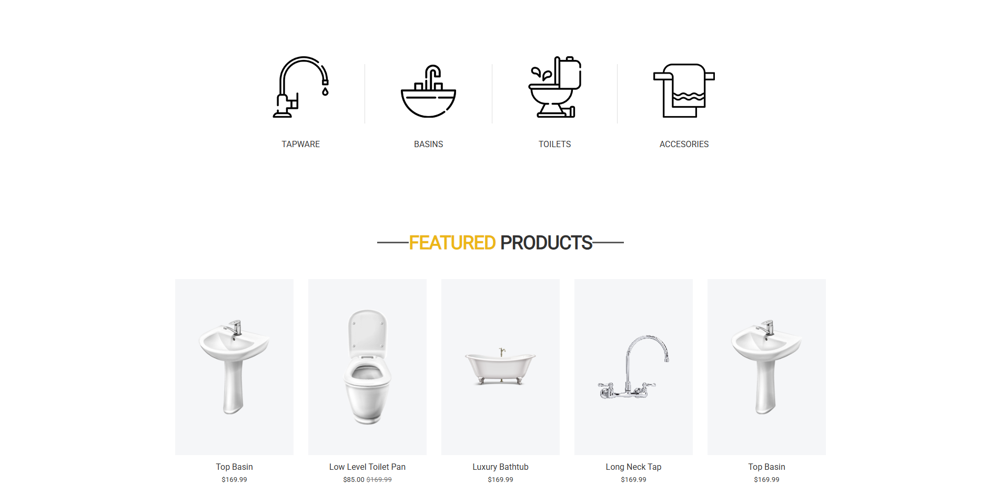
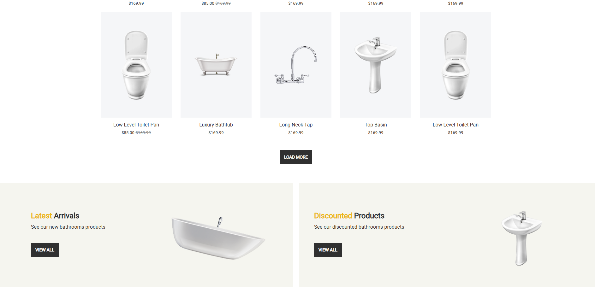
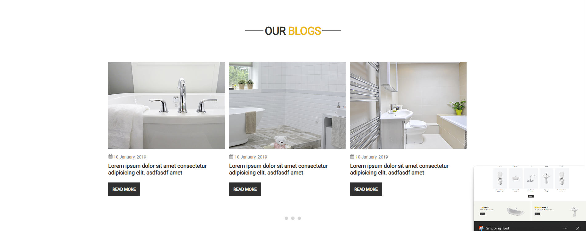
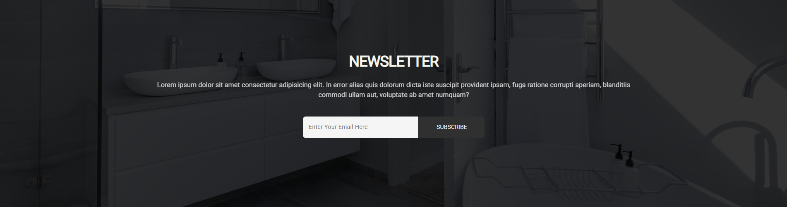
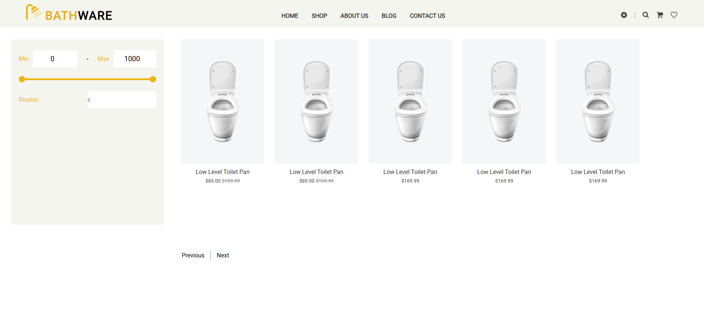
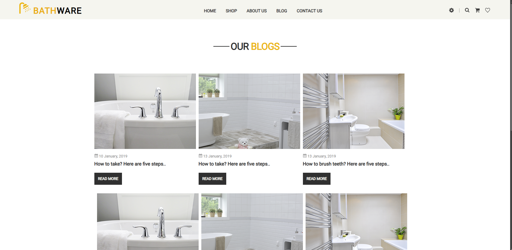
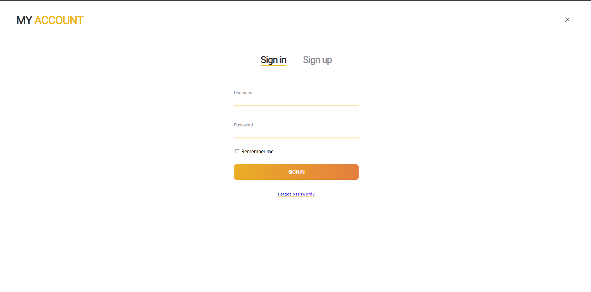
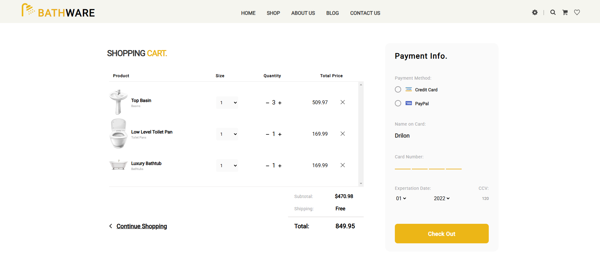
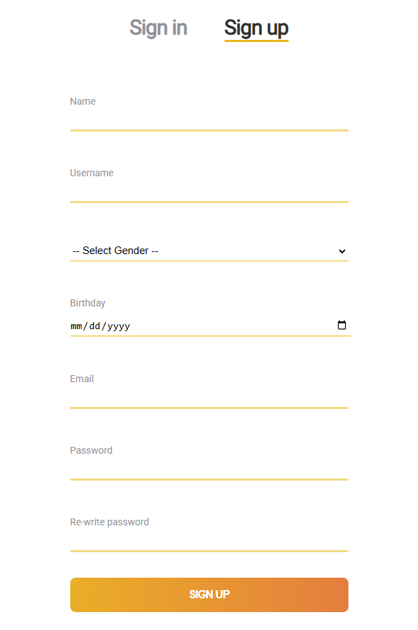

# Bathware Website

This website was developed as part of a group project for the "Programming in the World Wide Web" class at the University of Pristina. 

The project team consisted of: 

  
* <a href="https://github.com/drilonaliu"> Drilon Aliu</a>
* <a href="https://github.com/bardhshalaa" >Bardh Shala </a>
* <a href="https://github.com/DonHo0" > Don Hoxha </a>
  

The design template is based on the "Bathware Free PSD Template for Bathware Store" provided by Templates Jungle.

The website features the following pages:

* Main Page: Highlights the core features of the website.
* About: Provides information about the project or purpose.
* Products: Showcases the available products.
* Sign In: Allows users to log in to their accounts.
* Cart: Displays items added by the user for checkout.

 
 
   
   
   
   
   
  
    
    
   

